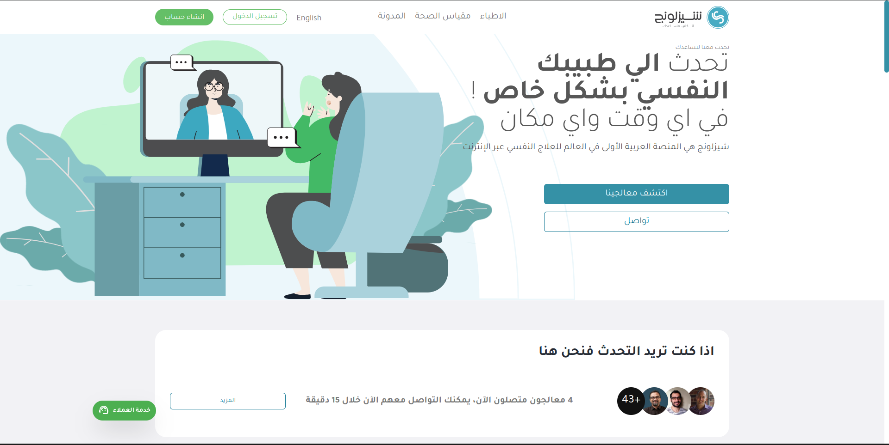

# Shazlong Clone

A Reverse engineering of shezlong web application.


---

## Table of Contents

- [About Shezlong](#about-shezlong)
- [Demo](#demo)
- [Features](#features)
- [Built With](#built-with)
- [Getting Started](#getting-started)
- [Installation](#installation)
- [Usage](#usage)
- [API Documentation](#api-documentation)
- [Contributing](#contributing)
- [License](#license)
- [Contact](#contact)

---

## About Shezlong

The Shazlong app, is a digital mental health platform that offers online therapy services across the MENA region and beyond. It provides users with access to licensed mental health professionals, allowing them to book sessions via video calls. The platform includes various therapeutic specializations such as treatment for depression, anxiety, addiction, and psychotic disorders. Shazlong's therapists are vetted professionals, and the platform supports options for both individual and corporate clients.


#### User Account Features

- **Online Therapy Booking System**: Users can easily schedule therapy sessions by selecting available time slots that fit their schedules.
- **Multi-Language Support**: The platform is accessible in English and Arabic, catering to a diverse user base.
- **User Feedback System**: After sessions, users provide feedback to help maintain high standards of care and improve therapist quality.
- **Session Rescheduling and Cancellation**: Users have the flexibility to reschedule or cancel appointments as needed.

#### Shazlong Doctor Account Features

- **Profile Management**: Doctors can create and manage their profiles, showcasing their qualifications, specialties, and languages spoken to attract potential clients.

- **Appointment Dashboard**: They have access to a personalized dashboard where they can view and manage upcoming appointments, access client histories, and prepare for sessions.

- **Feedback Mechanism**: Therapists can receive feedback and ratings from clients after sessions, allowing them to improve their services and increase visibility on the platform.

#### Shezlong Admin Features

- **User Management**: Admins oversee user accounts for both therapists and clients, ensuring proper credential verification and support.
- **Appointment Management**: Admins control the booking system, managing scheduled sessions, cancellations, and user requests efficiently.
- **Customer Support Tools**: Admins address user feedback and complaints to enhance the overall platform experience.

### Demo

[Demo](https://shazlong-clone.netlify.app/)

---

## Built With

- [React](https://reactjs.org/)
- [ReduxToolKit](https://redux-toolkit.js.org/)
- [React Suite](https://rsuitejs.com/)
- [Node.js](https://nodejs.org/)
- [Express](https://expressjs.com/)
- [MongoDB](https://www.mongodb.com/)


---

## Getting Started

###  Prerequisites


- Node.js >= 16.x
- npm >= 8.x

### Installation

1. Clone the repository:
    ```bash
    git clone https://github.com/shazlong-clone/shazlong-front.git
    cd shazlong-front
    ```

2. Install dependencies:
    ```bash
    npm install
    ```

3. Set up environment variables:

   Create `.env` and update the variables.
   
   REACT_APP_DEV_BASE_API = your backend server api for dev
   REACT_APP_PROD_BASE_API = your backend server api for prod

### Usage

Instructions for running the app in development mode.

```bash
npm start
```
